# AI Newsroom

A production-quality, student-friendly AI-powered OSINT newsroom. One operator runs a news website and an Instagram news channel from a single admin dashboard.

```mermaid
flowchart LR
    A["PUBLIC SOURCES"] --> B["INGESTION"]
    B --> C["DEDUPLICATION"]
    C --> D["SCOUT"]
    D --> E["RESEARCH"]
    E --> F["CLAIMS / VERIFICATION"]
    F --> G["ARTICLE"]
    G --> H["INSTAGRAM CONTENT"]
    H --> I["HUMAN APPROVAL"]
    I --> J["WEBSITE + INSTAGRAM"]
```



## Status

**Phase 8 — Writer agent (current).** The pipeline runs from RSS ingestion
through deduplication, scout scoring, web research (sources + initial claims),
claim-by-claim verification, and article drafting — every stage driven by the
abstracted LLM provider layer (Ollama/local first, OpenAI and Anthropic
optional) with deterministic fallbacks so the whole thing works keyless and
free. All artifacts persist as 14 tables via Alembic, with CRUD APIs for
sources/stories/articles and a dashboard to drive each stage. Human approval
and publish/discovery are the remaining phases — see `docs/roadmap.md`.

## Stack

| Layer    | Technology                                                        |
|----------|-------------------------------------------------------------------|
| Frontend | Next.js (App Router) · TypeScript · Tailwind CSS · shadcn/ui      |
| Backend  | Python · FastAPI · Pydantic · SQLAlchemy (async)                  |
| Database | PostgreSQL (pgvector-ready for future RAG)                        |
| AI       | Provider abstraction — Ollama/local first, providers replaceable  |

## Repository layout

```
├── frontend/    Public news website + admin dashboard (/dashboard)
├── backend/     FastAPI app (app/api, app/core, …) + tests
├── docs/        architecture.md · roadmap.md (+ database/agents as phases land)
├── scripts/     setup_dev.sh · create_db.sh
├── docker/      container artifacts (compose lives at repo root)
├── .env.example Env template — copy to backend/.env and frontend/.env.local
└── docker-compose.yml  PostgreSQL service (optional if using local Postgres)
```

## Prerequisites

- Node.js 20+ and npm
- Python 3.12+ and [uv](https://docs.astral.sh/uv/)
- PostgreSQL 16 running locally (or use `docker compose up db`)

## Quick start

```bash
./scripts/setup_dev.sh        # creates DBs, installs deps, copies env files
```

Then, in two terminals:

```bash
# backend — http://localhost:8000
cd backend
uv run uvicorn app.main:app --reload

# frontend — http://localhost:3000
cd frontend
npm run dev
```

Manual setup:

```bash
# databases
createdb ai_newsroom && createdb ai_newsroom_test

# backend
cd backend
uv venv && uv sync
cp .env.example .env
uv run pytest                       # run tests
uv run uvicorn app.main:app --reload

# frontend
cd frontend
npm install
cp .env.example .env.local
npm run dev
```

Optionally run the database in Docker instead of local PostgreSQL:

```bash
docker compose up db
# then point DATABASE_URL in backend/.env at postgres:5432
```

## What works right now

- `GET /api/v1/health` — backend + database connectivity status
- `GET /` — service info; interactive API docs at `/docs`
- Full CRUD API: `/api/v1/sources`, `/api/v1/stories` (auto-slugs, source linking), `/api/v1/articles` (auto `published_at` on publish) — paginated list responses (`items/total/limit/offset`) with status/category filters
- RSS ingestion: `POST /api/v1/ingestion/run`, `POST /api/v1/ingestion/sources/{id}/fetch`, `GET /api/v1/ingestion/jobs/{id}` (async jobs, poll for completion) — see `docs/ingestion.md`
- Deduplication: `POST /api/v1/dedup/run` (maintenance merge job), `POST /api/v1/dedup/merge` (manual merge), `GET /api/v1/dedup/candidates` (near-miss review) — see `docs/dedup.md`
- Scout agent: `POST /api/v1/scout/run` (batch scoring job) and `POST /api/v1/scout/stories/{id}` (single story) grade each story with category, importance (`0-10`), `should_research`, and a reason — Ollama-backed with a rules fallback — see `docs/agents.md`
- Research: `POST /api/v1/research/run` (batch job) and `POST /api/v1/research/stories/{id}` research recommended stories — web search (`WEB_SEARCH_BACKEND`: DuckDuckGo/Bing keyless, Serper optional, comma-separated fallback chain), URL fetch with charset-aware decoding (Content-Type → HTML meta → charset sniffing, so non-UTF-8 pages like Chinese/Korean sites are read cleanly instead of turning into mojibake), text extraction (`app/tools/`), ResearchAgent, initial claims; `GET /api/v1/research/runs/{story_id}` returns the package (runs, sources, claims with evidence) — see `docs/agents.md`
- Verification: `POST /api/v1/verification/run` and `POST /api/v1/verification/stories/{id}` verify a story's claims against evidence (CONFIRMED/LIKELY/UNCONFIRMED/CONTRADICTED with confidence + reasoning); `GET /api/v1/verification/stories/{story_id}` reads the package; `PATCH /api/v1/verification/claims/{claim_id}` edits a verdict — see `docs/agents.md`
- Articles: `POST /api/v1/articles/generate` and `POST /api/v1/articles/generate/stories/{id}` draft articles from verified research (structured headline/body/SEO output) — the writer always produces articles in English, faithfully translating non-English source material instead of copying it verbatim; `GET/PATCH /api/v1/articles/{id}` edit and move through DRAFT → REVIEW → APPROVED → PUBLISHED — see `docs/agents.md`
- Postgres schema: 13 models / 14 tables (sources, stories, claims, evidence, research runs, articles, social posts, media assets, agent runs, publishing jobs, users, audit log) via Alembic migration `e5f6a7b8c9d0` (research fields; prev `d0e1f2a3b4c5` scout fields, head) — see `docs/database.md`
- Seed script: admin operator + 10 RSS sources (`python -m scripts.seed`)
- Backend test suite (`uv run pytest`, 200 tests)
- Next.js frontend: public landing pages + admin dashboard (sidebar, dark mode, health card, sources/stories tables with live ingestion controls + Run dedup + Run scout + Run research, research queue with clickable per-story research packages, verification queue, article editor)

## Tests

```bash
cd backend && uv run pytest
```

Frontend checks:

```bash
cd frontend && npm run build    # type-check + production build
```

## Configuration

All configuration via environment variables — see `.env.example` and `backend/app/core/config.py`. Secrets are never committed and never shipped to the browser.

| Variable         | Where            | Purpose                          |
|------------------|------------------|----------------------------------|
| `DATABASE_URL`   | backend/.env     | asyncpg Postgres connection      |
| `CORS_ORIGINS`   | backend/.env     | Allowed browser origins          |
| `ENVIRONMENT`    | backend/.env     | dev/production                    |
| `LLM_PROVIDER`   | backend/.env     | LLM backend for agents (`ollama`)|
| `OLLAMA_URL`     | backend/.env     | Ollama server base URL           |
| `OLLAMA_MODEL`   | backend/.env     | Ollama model name                |
| `NEXT_PUBLIC_API_URL` | frontend/.env.local | Backend base URL           |

## Documentation

- `docs/architecture.md` — system architecture and layer map
- `docs/ingestion.md` — RSS pipeline, job runner, ingestion API
- `docs/dedup.md` — similarity rules, merging, dedup APIs
- `docs/agents.md` — LLM provider layer, research tool layer, and agent design (scout + research agents)
- `docs/database.md` — schema, migrations, seed, testing
- `docs/roadmap.md` — phased development plan (12 phases)

## Editorial rules (non-negotiable)

1. Never fabricate sources, quotes, or facts.
2. Never hide uncertainty — show confidence and contradictions.
3. Preserve source URLs and publication dates.
4. Prefer primary sources; verify before publish.
5. Every publication requires explicit human approval.

## GitHub

Repository: https://github.com/Divanshiv/News