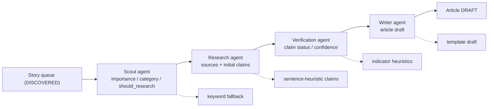
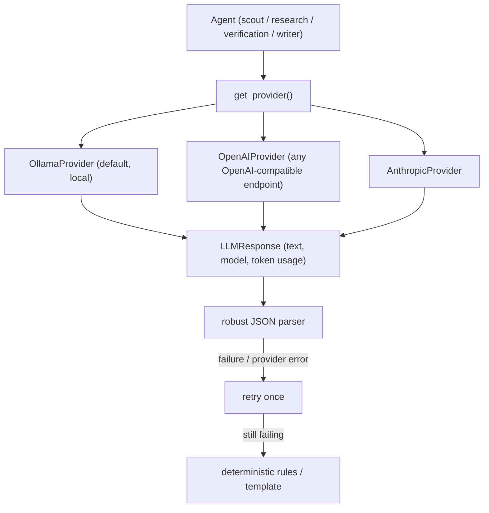
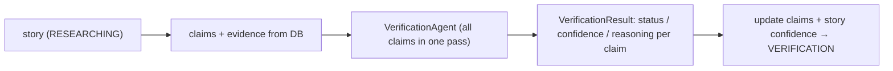
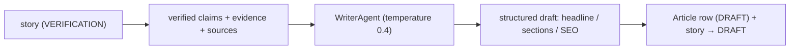

# Agents

Agents are the AI workers of the newsroom. Each agent takes structured input,
produces structured output, and depends on an LLM provider — never on a
concrete model or server.



Each agent runs inside a background `app/workers/` job, writes structured
artifacts (claims, evidence, sources, runs, drafts) to PostgreSQL, and falls
back to deterministic rules when the LLM provider is unavailable.

## LLM provider layer

`app/services/llm/` defines the provider contract (spec §22):

| File            | Purpose                                        |
|-----------------|------------------------------------------------|
| `base.py`       | `LLMProvider` ABC + `LLMResponse` + `LLMError` |
| `ollama.py`     | `OllamaProvider` — local Ollama REST API        |
| `openai.py`     | `OpenAIProvider` — OpenAI Chat Completions API |
| `anthropic.py`  | `AnthropicProvider` — Anthropic Messages API   |
| `__init__.py`   | `get_provider()` factory (env-driven)          |

`LLMProvider.generate(prompt, *, system, format, temperature, max_tokens)`
returns `LLMResponse(text, model, prompt_tokens, completion_tokens)`. Agents
call `get_provider()` to obtain the configured backend; swapping providers is a
config change, not a code change. `format` may be `"json"` or a JSON schema.

Provider notes:

- **Ollama** enforces the schema server-side (`format`), so agents never parse
  prose. Endpoint `POST {url}/api/generate`; usage from `prompt_eval_count` /
  `eval_count`; `404` (model not installed) and transport errors raise
  `LLMError`.
- **OpenAI** maps `format` to `response_format={"type": "json_object"}`, and
  works against any OpenAI-compatible endpoint via `OPENAI_BASE_URL` (Azure,
  local proxies). Usage comes from `usage.prompt_tokens` /
  `usage.completion_tokens`; `401`/`429` and transport errors raise `LLMError`.
- **Anthropic** has no `response_format`; a JSON-schema `format` appends an
  "output raw JSON only" instruction instead, and the scout's robust parser +
  rules fallback absorbs any prose. `max_tokens` is required by the Messages
  API and defaults to `ANTHROPIC_MAX_TOKENS`. Usage from
  `usage.input_tokens` / `usage.output_tokens`; `401`/`429` and transport
  errors raise `LLMError`.

Configuration (`backend/.env`):

| Variable                 | Default                      | Purpose                 |
|--------------------------|------------------------------|-------------------------|
| `LLM_PROVIDER`           | `ollama`                     | Provider selected by `get_provider()` (ollama \| openai \| anthropic) |
| `OLLAMA_URL`             | `http://localhost:11434`     | Ollama server base URL  |
| `OLLAMA_MODEL`           | `llama3.2`                   | Model name              |
| `OLLAMA_TIMEOUT_SECONDS` | `60`                         | Per-request timeout     |
| `OPENAI_API_KEY`         | *(empty)*                    | Bearer token (required for openai) |
| `OPENAI_MODEL`           | `gpt-5-mini`                 | Chat Completions model  |
| `OPENAI_BASE_URL`        | `https://api.openai.com/v1`  | Any OpenAI-compatible endpoint |
| `OPENAI_TIMEOUT_SECONDS` | `60`                         | Per-request timeout     |
| `ANTHROPIC_API_KEY`      | *(empty)*                    | `x-api-key` header (required for anthropic) |
| `ANTHROPIC_MODEL`        | `claude-sonnet-4-20250514`   | Messages API model      |
| `ANTHROPIC_BASE_URL`     | `https://api.anthropic.com`  | Messages API base URL   |
| `ANTHROPIC_MAX_TOKENS`   | `4096`                       | Required default cap    |
| `ANTHROPIC_TIMEOUT_SECONDS` | `60`                       | Per-request timeout     |

API keys are read from the environment only and never surface through the
API or to the browser — `GET /api/v1/meta/config` exposes provider/model
names but never credentials. All-provider failures fall back to the scout's
deterministic rules, so the pipeline stays runnable when a provider is
unavailable or unconfigured.



`LLM_PROVIDER` picks the backend; agents never touch provider-specific code.

## Scout agent

`app/agents/scout.py` — the first production agent (Phase 5). It grades a
single story and emits a `ScoutVerdict`:

```json
{
  "should_research": true,
  "importance": 7,
  "category": "AI",
  "reason": "Significant model release."
}
```

The verdict is enforced by a JSON schema sent via `format`, so output is valid
by construction. The agent:

1. Builds a prompt from title/summary/source category/publication date.
2. Calls the provider with a strict system prompt and low temperature.
3. Parses the JSON robustly (strips fenced/prose-wrapped output, coerces
   category to the fixed `SOURCE_CATEGORIES` set).
4. Retries once on provider or parse failure (`DEFAULT_MAX_RETRIES = 1`).
5. Falls back to deterministic keyword rules when the LLM is unavailable, so
   the app stays runnable and free locally (importance 4 default; funding →
   8, breaches → 9, etc.; `should_research = importance >= 6`; category from
   keyword votes or the source hint).

## Research agent

`app/agents/research.py` — the second production agent (Phase 6). It gathers
background on a story and emits a `ResearchPackage`:

```json
{
  "sources": [
    {
      "url": "https://example.com/announcement",
      "title": "Example News Headline",
      "snippet": "The full snippet text about the event.",
      "tier": "primary",
      "relevance": 0.9,
      "fetched": true
    }
  ],
  "claims": [
    {
      "claim_text": "Example Corp announced a new product line.",
      "status": "unverified",
      "confidence": 0.7,
      "evidence_urls": ["https://example.com/announcement"]
    }
  ]
}
```

### Tool abstraction (`app/tools/`, spec §23)

Agents never touch the network directly — they depend on tool interfaces so
providers stay replaceable and tests stay pure:

| Tool                  | Default implementation                    | Notes                                      |
|-----------------------|--------------------------------------------|--------------------------------------------|
| `WebSearchTool`       | `DuckDuckGoWebSearch` (keyless)           | `BingWebSearch` (keyless); `SerperWebSearch` (`SERPER_API_KEY`); comma-separated `WEB_SEARCH_BACKEND` chains them as a `FallbackWebSearch` |
| `URLFetchTool`        | httpx GET with retries + `max_bytes` cap  | JSON inline results are skipped            |
| `TextExtractionTool`  | stdlib `HTMLParser` → title + text        | No new dependencies; markdown/scripts stripped |
| `SourceLookupTool`    | DB get-or-create by normalized URL        | Tiers: primary/gov/edu/github/arxiv, social, news |

`build_research_tools()` builds the full set from app config; workers inject
fakes for tests. `normalize_research_url` strips tracking params
(`utm_*`, `ref`, `fbclid`, `gclid`) so the same source deduplicates.

### Research flow

1. `build_queries` derives 2 rule-based queries from the story title
   (boosted by "official announcement" / "press release" / "statement").
2. Each query runs through `WebSearchTool`; results are deduplicated by
   normalized URL (max `max_sources`).
3. If combined results are thinner than `max_sources`, up to 2 extra
   site-restricted fallback queries run against OSINT-flavored authoritative
   domains per category (`osint_fallback_queries` — e.g. `nasa.gov` /
   `isro.gov.in` for Space, `pib.gov.in` / `thehindu.com` for India).
4. Up to `fetch_limit` top results are fetched and stripped to plain text by
   `TextExtractionTool` (capped at `research_text_max_chars`).
5. The provider extracts claims as JSON against a strict `_CLAIMS_JSON_SCHEMA`
   (`claims[] {claim_text, status, confidence, evidence_urls}`); robust JSON
   parsing + retry once, then a sentence-heuristic fallback keeps the pipeline
   runnable when no LLM is configured.

Config (`backend/.env`): `WEB_SEARCH_BACKEND` (`duckduckgo` | `bing` |
`serper`, or comma-separated fallback chain like `duckduckgo,bing` — tried in
order until one returns results), `SERPER_API_KEY`,
`RESEARCH_MAX_SOURCES=6`, `RESEARCH_MAX_QUERIES=2`, `RESEARCH_FETCH_LIMIT=4`,
`RESEARCH_TEXT_MAX_CHARS=6000`.

```mermaid
flowchart LR
    T["story title + summary"] --> Q["build_queries (2 rule-based, category-boosted)"]
    Q --> WS["WebSearchTool<br/>duckduckgo → bing → (serper) fallback chain"]
    WS -- "thin results" --> OSINT["OSINT fallback queries<br/>site-restricted per category"]
    WS --> DED["dedupe by normalized URL"]
    OSINT --> DED
    DED --> FETCH["URLFetchTool (top N)"]
    FETCH --> EX["TextExtractionTool<br/>plain text, capped"]
    EX --> LLM["LLM extracts claims (strict JSON schema)"]
    LLM --> PERSIST["persist_package → sources / story_sources / claims + evidence"]
```



### Execution and persistence

`workers/research.py` registers the `research_story` job. It researches the
oldest unresearched `DISCOVERED` stories flagged `should_research = true`
(batch 20) or a single story via `{"story_id": id}`. Already-researched
stories are skipped. `app/services/research.py::persist_package` writes the
package: sources (get-or-create with tier-boosted reliability), `story_sources`
links (`relationship_note="research ({tier})"`), initial claims + evidence, and
marks the run `COMPLETED` and the story `RESEARCHING` (`researched_at` set).

## Verification agent

`app/agents/verification.py` — the third production agent (Phase 7). It verifies
claims against collected evidence and emits a `VerificationResult`:

```json
{
  "claims": [
    {
      "claim_id": 1,
      "claim_text": "Company X announced a new product.",
      "status": "CONFIRMED",
      "confidence": 0.9,
      "reasoning": "Supported by official announcement.",
      "supporting_sources": ["https://example.com"],
      "contradicting_sources": []
    }
  ],
  "overall_confidence": 0.9,
  "summary": "Claim verified."
}
```

The agent:

1. Takes a list of claims with their evidence URLs and text snippets.
2. Builds a verification prompt with claim text and evidence.
3. Calls the provider with a strict JSON schema for structured output.
4. Parses the response robustly (fenced JSON, prose wrapping).
5. Retries once on provider or parse failure.
6. Falls back to heuristic verification when no LLM is available.

Heuristic rules:

- Count contradiction indicators (denied, false, refuted, etc.).
- Count confirmation indicators (confirmed, verified, announced, etc.).
- Multiple contradictions → CONTRADICTED (0.3 confidence).
- Multiple confirmations + 2+ sources → CONFIRMED (0.7 confidence).
- Some evidence → LIKELY (0.5 confidence).
- No evidence → UNCONFIRMED (0.3 confidence).

### Verification flow

1. `workers/verification.py` registers the `verify_story` job.
2. For each story in RESEARCHING status, it gathers claims with evidence.
3. The `VerificationAgent` processes all claims in one pass.
4. Claim statuses and confidence scores are updated in the database.
5. Story status moves to VERIFICATION with overall confidence.



### Claim statuses

| Status        | Meaning                                      |
|---------------|----------------------------------------------|
| CONFIRMED     | Strong evidence from multiple sources        |
| LIKELY        | Some supporting evidence                     |
| UNCONFIRMED   | Insufficient evidence to verify              |
| CONTRADICTED  | Evidence opposes the claim                   |

## Writer agent

`app/agents/writer.py` — the fourth production agent (Phase 8). It drafts a
news article from a story's verified research package and emits an
`ArticleDraft`:

```json
{
  "headline": "Company X Announces Product Y",
  "subheadline": "New launch set for December",
  "summary": "Company X unveiled Product Y today.",
  "body": "## What Happened\n\n...\n\n## Key Details\n\n- Product Y launches December 1.\n\n## How We Know\n\n...\n\n## Sources\n\n- https://example.com/press"
}
```

The agent:

1. Takes the story title/summary/category plus verified claims (status +
   confidence) and the source URLs backing them.
2. Builds a writing prompt with the claims and sources.
3. Calls the provider with a strict JSON schema (`headline`, `subheadline`,
   `summary`, `what_happened`, `key_details`, `why_it_matters`,
   `what_happens_next`, `how_we_know`, `sources`, `seo_title`,
   `seo_description`) at a moderate temperature (0.4).
4. Parses the response robustly and assembles the article body as a
   markdown-style document with `## What Happened` / `## Key Details` /
   `## Why It Matters` / `## What Happens Next` / `## How We Know` /
   `## Sources` sections.
5. Retries once on provider or parse failure.
6. Falls back to a deterministic template (headline from title, body from
   confirmed claims, sources appended) when no LLM is available.

### Writing flow

1. `workers/article.py` registers the `generate_article` job.
2. For each story in VERIFICATION status (batch 10) or via
   `{"story_id": id}`, it gathers verified claims + evidence URLs and backing
   source URLs.
3. The `WriterAgent` produces the draft.
4. An `Article` row is created in DRAFT status and the story moves to DRAFT.
5. Stories without claims or with an existing article are skipped; merged or
   missing stories are reported as errors.



The writer never invents facts: it only composes from the claims/evidence it
is given. SEO title/description default to truncated headline/summary.

## API

| Method | Path                        | Behavior                        |
|--------|-----------------------------|---------------------------------|
| POST   | `/api/v1/scout/run`         | 202 → `run_scout` job, batch    |
| POST   | `/api/v1/scout/stories/{id}`| 202 → `run_scout` job, single   |
| POST   | `/api/v1/research/run`      | 202 → `research_story` job, batch |
| POST   | `/api/v1/research/stories/{id}` | 202 → `research_story` job, single |
| GET    | `/api/v1/research/runs/{story_id}` | 200 → `StoryResearchRead` (runs, sources, claims with evidence) |
| POST   | `/api/v1/verification/run`  | 202 → `verify_story` job, batch |
| POST   | `/api/v1/verification/stories/{id}` | 202 → `verify_story` job, single |
| GET    | `/api/v1/verification/stories/{story_id}` | 200 → `StoryVerificationRead` (claims with evidence) |
| PATCH  | `/api/v1/verification/claims/{claim_id}` | 200 → Update claim status/confidence |
| POST   | `/api/v1/articles/generate` | 202 → `generate_article` job, batch |
| POST   | `/api/v1/articles/generate/stories/{id}` | 202 → `generate_article` job, single |
| GET    | `/api/v1/articles`          | 200 → list paginated articles (status filter) |
| GET    | `/api/v1/articles/{id}`     | 200 → single article |
| GET    | `/api/v1/articles/by-story/{story_id}` | 200 → article for a story (or null) |
| PATCH  | `/api/v1/articles/{id}`     | 200 → update headline/body/SEO/status |

Jobs run on the shared in-process runner and are polled via
`GET /api/v1/ingestion/jobs/{id}` (§24).

## Testing

Providers are tested with `httpx.MockTransport`; agents with a fake provider
that replays canned responses/exceptions. The `run_scout` job is faked in
`tests/conftest.py` for API tests; worker tests run the real handler against
the test database with a fake provider. Research tools are tested against
fixture HTML (DuckDuckGo result markup, messy article HTML); the
`research_story` job is faked in API tests the same way as scout.
Verification agent tests (`test_verification_agent.py`) cover LLM parsing,
fenced JSON stripping, retry logic, heuristic fallback, and edge cases.
Writer agent tests (`test_writer_agent.py`) cover JSON parsing, fenced
stripping, retry, template fallback (including empty claims), and prompt
assembly; `test_article_worker.py` covers draft persistence, skip rules,
batch targeting, and error paths.