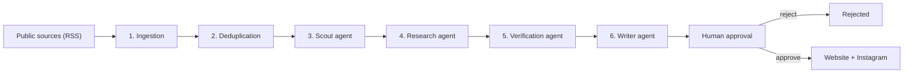
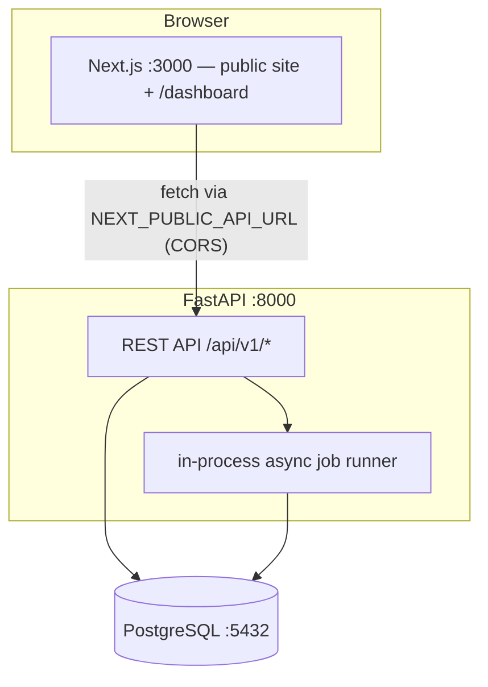
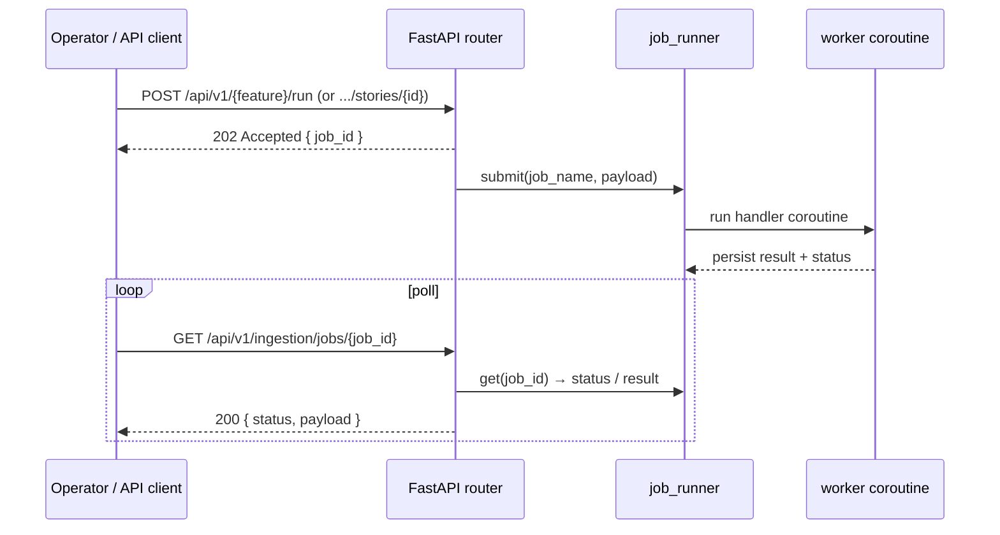

# Architecture

## Status — Phase 8 (Writer agent)

The repository is a monorepo with three top-level components:

```
News/
├── frontend/    Next.js + TypeScript + Tailwind + shadcn/ui (public site + admin dashboard)
├── backend/     Python + FastAPI + SQLAlchemy (async) + PostgreSQL
├── docs/        Architecture, database, agent, and workflow documentation
├── scripts/     Developer helper scripts
└── docker-compose.yml  PostgreSQL service (compose lives at repo root)
```

## Pipeline at a glance



Every agent step writes structured artifacts into PostgreSQL — stories, claims,
evidence, sources, research runs, and article drafts — so a human can review each
stage in the dashboard.

## Runtime layout



The Next.js client talks to the backend **directly** from the browser
(`NEXT_PUBLIC_API_URL`), not through a Next.js server rewrite. `CORS_ORIGINS`
must therefore include the frontend origin.

### Backend layer map

| Layer      | Path                  | Responsibility                          |
|------------|-----------------------|-----------------------------------------|
| API        | `app/api/`            | HTTP routers: health, sources, stories, articles, ingestion, dedup, scout, research, verification, backfill, jobs, meta |
| Core       | `app/core/`           | Settings, DB engine/session, structured JSON logging |
| Models     | `app/models/`         | SQLAlchemy ORM models (14 tables)      |
| Schemas    | `app/schemas/`        | Pydantic request/response models       |
| Services   | `app/services/rss/`   | Feed fetch (httpx), parse (feedparser), normalize (canonical URLs) |
| Services   | `app/services/ingestion.py` | Ingestion pipeline, dedup, Story/Source linking |
| Services   | `app/services/dedup/` | Similarity scoring + story merging (P4)|
| Services   | `app/services/llm/`   | LLM provider abstraction (ollama / openai / anthropic) |
| Services   | `app/services/research.py` | Research package persistence (P6) |
| Workers    | `app/workers/`        | In-process async job runner + job handlers (ingestion, dedup, scout, research, verification, article, backfill) |
| Agents     | `app/agents/`         | Scout, Research, Verification, Writer agents |
| Tools      | `app/tools/`          | Web search (DuckDuckGo/Bing/Serper), URL fetch, text extraction, source lookup |

### Frontend layer map

| Path                    | Purpose                              |
|-------------------------|--------------------------------------|
| `app/`                  | App Router pages (public + dashboard)|
| `components/`           | React components (`ui/` = shadcn)    |
| `lib/api.ts`            | Typed backend API client (apiGet/apiPost) |
| `types/`                | Shared TypeScript types              |

## Job execution model

Background work runs on a small in-process async job runner
(`app/workers/jobs.py`). Jobs are submitted over the API (202 Accepted with a
job id), processed by worker coroutines on the same event loop, and polled via
`GET /api/v1/ingestion/jobs/{job_id}`. This is intentionally minimal for
single-process local/dev deployments; for multi-worker production, swap the
runner for Redis + ARQ while keeping the `submit`/`get` interface stable.



Job handlers are registered on the shared `job_runner` at import time so the
runner works under any server (uvicorn lifespan, test transports, …).

## Configuration & secrets

- All configuration is read from the environment (see `.env.example`).
- Backend uses `pydantic-settings`; unknown env vars are ignored.
- Secrets are never committed and never shipped to the browser.
- CORS is restricted to configured origins only.

## Development flow

```
npm run dev  (frontend, :3000)
uvicorn app.main:app --reload  (backend, :8000)
postgres (local Homebrew :5432 or `docker compose up db`)
```

## Phased status

| Phase | Status |
|-------|--------|
| 1 Foundation  | ✅ done |
| 2 Database    | ✅ done |
| 3 RSS ingestion | ✅ done — see `docs/ingestion.md` |
| 4 Deduplication | ✅ done — see `docs/dedup.md` |
| 5 Scout agent | ✅ done — see `docs/agents.md` |
| 6 Research agent | ✅ done — see `docs/agents.md` |
| 7 Verification agent | ✅ done — see `docs/agents.md` |
| 8 Writer agent | ✅ done — see `docs/agents.md` |
| 9–12          | planned — see `docs/roadmap.md` |