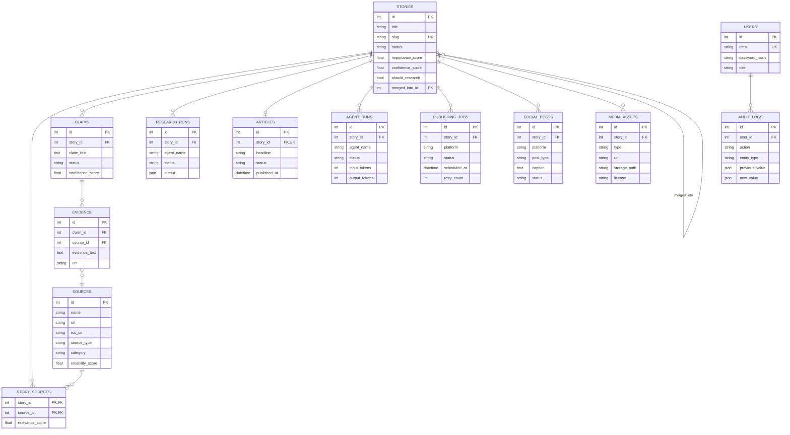

# Database

## Status — Phase 8 (Writer agent)

Async SQLAlchemy 2.0 (`SQLAlchemy[asyncio]`) + `asyncpg` + Alembic migrations.
Engine and session factory live in `backend/app/core/database.py`; the declarative
`Base` uses the `NAMING_CONVENTION` from `app/core/database.py` so every generated
constraint/index has a stable, consistent name.

Connection string (from `DATABASE_URL` in `backend/.env`, see `.env.example`):

```
postgresql+asyncpg://localhost:5432/ai_newsroom
```

## Entity relationship

13 entities / 14 tables. Preview only — see the model files for full columns.



### Cascade behavior (important)

- **`stories` → dependents cascade on delete**: `story_sources`, `claims`
  (+ `evidence`), `research_runs`, `articles`, `social_posts`, `media_assets`,
  `publishing_jobs` all use `ondelete="CASCADE"`. Deleting a story removes its
  entire downstream research/article footprint (but never its merged children).
- **`merged_into` / `merged_stories`** use `ondelete="SET NULL"` — a merged child
  is *spared* when the absorbing story is deleted, preserving the link's intent.
- **`agent_runs.story_id`** is `SET NULL`; **`audit_logs.user_id`** is `SET NULL`;
  **`evidence.source_id`** has no cascade (a source deletion leaves evidence text).

## Schema overview — 14 tables across 13 entities

| Entity             | Model file        | Notes                                             |
|--------------------|-------------------|---------------------------------------------------|
| Sources            | `models/source.py`| RSS feeds + basic metadata, `unique_slug`         |
| Stories            | `models/story.py` | Story lifecycle + scores, `unique_slug`           |
| Story–Source links | `models/story.py` | `story_sources` M2M; composite PK, cascades       |
| Claims             | `models/claim.py` | Extracted claims with verification status         |
| Evidence           | `models/claim.py` | URLs/notes backing a claim                        |
| Research runs      | `models/research.py` | Per-story agent research runs                  |
| Articles           | `models/article.py`| SEO fields, DRAFT → PUBLISHED timestamps          |
| Social posts       | `models/social.py`| Instagram image/carousel/reel drafts              |
| Media assets       | `models/social.py`| `metadata_json` column maps to reserved `metadata`|
| Agent runs         | `models/agents.py`| Scout/Research/Verification/Writer runs           |
| Publishing jobs    | `models/agents.py`| Website + Instagram publish attempt records       |
| Users              | `models/user.py`  | Local auth; hashed `password_hash`                |
| Audit log          | `models/audit.py` | Append-only operator/action log                   |

### Resolved SQLAlchemy gotchas

- MediaAsset uses `metadata_json` (column `"metadata"`) — `metadata` is reserved
  by the `MetaData` API.
- StorySource uses `relationship_note` (column `"relationship"`) — a plain
  column named `relationship` shadows the `relationship()` declarative API.

### Status constants (defined in the model modules)

| Model            | Values                                                       |
|------------------|--------------------------------------------------------------|
| Story            | DISCOVERED · RESEARCHING · VERIFICATION · DRAFT · REVIEW · APPROVED · PUBLISHED · REJECTED · MERGED |
| Claim            | CONFIRMED · LIKELY · UNCONFIRMED · CONTRADICTED              |
| Article          | DRAFT · REVIEW · APPROVED · PUBLISHED                        |
| ResearchRun      | PENDING · RUNNING · COMPLETED · FAILED                       |
| AgentRun         | PENDING · RUNNING · COMPLETED · FAILED                       |
| SocialPost       | platforms: instagram; types: image · carousel · reel         |

Note: `users`, `social_posts`, `media_assets`, `agent_runs`, and `publishing_jobs`
currently have **no API/worker consumers yet** — they are schema for roadmap
phases 9–12 (website publishing, Instagram, RAG).

## Migrations

Alembic is configured for async (`alembic init -t async alembic`); `alembic/env.py`
imports `app.models` and reads `settings.database_url`, so migrations always target
the environment's `DATABASE_URL`.

```bash
cd backend
uv run alembic revision --autogenerate -m "describe change"
uv run alembic upgrade head
uv run alembic downgrade -1     # roll back one step
```

Migration chain (head = `e5f6a7b8c9d0`):

| Revision        | Contents                                  |
|-----------------|-------------------------------------------|
| `1851973ad4c4`  | Core tables (sources, stories, claims, evidence, articles, …) |
| `e7f2a91b5c03`  | RSS ingestion fields (`rss_url`, `last_fetch_*`, …) |
| `c9d8e7f0a1b2`  | Story merge fields (`merged_into_id`, …)  |
| `d0e1f2a3b4c5`  | Scout fields (`importance_score`, `should_research`, …) |
| `e5f6a7b8c9d0`  | Research fields (`researched_at`, research runs output) |

## Seed data

Idempotent seed (safe to re-run) — creates the admin operator and a default set
of RSS sources:

```bash
cd backend
uv run python -m scripts.seed
```

| Item            | Value                             |
|-----------------|-----------------------------------|
| Admin email     | `admin@ainewsroom.local`          |
| Admin password  | `admin123`                        |
| Sources         | 10 (Ars Technica, BleepingComputer, …) |

## Testing

Tests run against a separate database (`ai_newsroom_test`) so dev data is never
touched. `backend/tests/conftest.py` forces `DATABASE_URL` to the test database,
drops/creates all tables per test (autouse fixture), and exposes an async
`httpx.AsyncClient` via an ASGI transport. The shared engine pool is disposed
after each test because pytest-asyncio runs each test in a fresh event loop and
asyncpg connections are loop-bound.

```bash
cd backend
uv run pytest          # ~150 tests: CRUD + ingestion + dedup + agents + workers
```